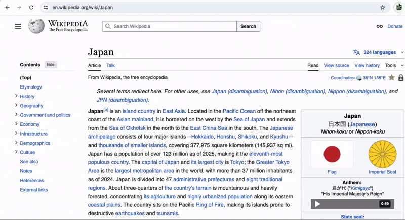

# Vocabify

## Description
This is a simple Chrome extension for practicing vocabulary for a language that you're learning. It was inspired by WaniKanify / WaniKanify 2.0. While I plan to add support for custom vocab lists, the current version is only designed to work with the [WaniKani API](https://docs.api.wanikani.com/).

It supports most major browsers.

## Future Plans
- [ ] Add more/better tests for existing features
- [ ] Add UI elements to make the update progress more obvious after setting the api key
- [ ] Add a force refresh button to the popup (note: this can currently be done by updating the api key and reloading the page)
- [ ] Add more details to the on-hover tooltips
- [ ] Add an option for disabling on-hover tooltips
- [ ] Add options for configuring the update interval (currently subject and user data is updated every 24 hours, and assignment data is updated every hour [[1](https://github.com/rowan-walshe/vocabify/blob/main/packages/storage/lib/impl/userPreferencesStorage.ts#L104), [2](https://github.com/rowan-walshe/vocabify/blob/main/chrome-extension/src/background/index.ts#L21)])
- [ ] Create a stats page
- [ ] Add support for custom vocab lists

## Developer Info

For a developer guide please see [CONTRIBUTING](https://github.com/rowan-walshe/vocabify/blob/main/CONTRIBUTING.md).

## Special Thanks To

[Jonghakseo](https://jonghakseo.github.io/) for his awesome [chrome-extension-boilerplate-react-vite](https://github.com/Jonghakseo/chrome-extension-boilerplate-react-vite) template.
